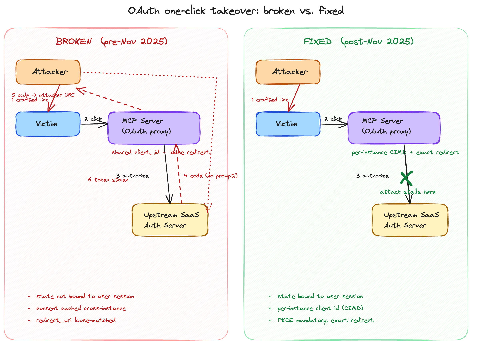
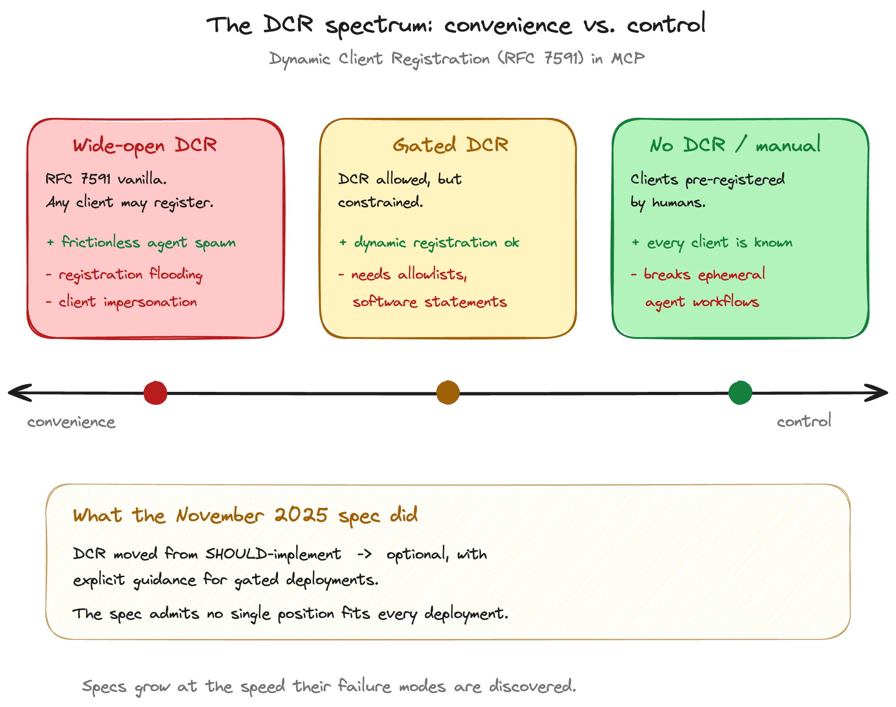

Title: OAuth's Original Sin: Why MCP Inherited a Problem Designed for Humans
Date: 2026-06-19 22:48
Category: AI
Tags: llm, mcp, oauth, security, claude, authentication
Slug: oauth-original-sin-mcp-auth
Author: Sam Reghenzi
Summary: The third post in the MCP series. The first two argued *when* MCP wins and loses. This one looks at the terrain MCP is supposed to win on — OAuth-bound integrations — and shows why even there, the ground is more fragile than it looks.

Two posts ago I drew what felt like a clean line: MCP earns its keep when text and shell are genuinely insufficient — and one of the canonical examples I gave was "holding an OAuth session." It still is. But it is also the case I most undersold. Because OAuth, the protocol now standing under every serious MCP integration, was not designed for what we are about to do to it.

OAuth was designed for a human, sitting at a keyboard, reading a consent screen, clicking *Allow*. Every layer of the protocol — the browser redirect, the authorization code that crosses domains, the refresh token that lives on a device the user controls — presumes that human in the loop. MCP quietly removes them. What remains is the protocol, the tokens, and a language model holding both.

This post is about what happens when you take a security architecture designed for a conscious human and run it under software that has neither eyes nor hesitation.

## The protocol that assumed a human

It is worth saying out loud, because the assumption is so deep we no longer notice it: OAuth is a protocol whose defensive mechanisms only work because a person is paying attention.

The standard story names three actors — resource owner, client, resource server — but the protocol's whole defensive posture is built around a fourth, implicit actor: a conscious human in front of the client. The redirect URI matching only matters because someone might notice the URL bar is wrong. The consent screen only works because someone reads "this app would like to access your calendar" and decides whether that is acceptable. The scope display only protects you if you scan the list. Even refresh tokens were designed with the unstated assumption that long-lived background activity would be rare, deliberate, and visible to the user whose token it was.

Take that human out, and OAuth still *runs* — but most of what made it safe stops working.

Now name what removed them. Not malware, not a clever new attack class. An interface change. We replaced "person, browser, consent screen" with "agent, MCP client, system prompt." The protocol below didn't change. The contract above did.

## What MCP inherited

To MCP's credit, it inherited the best version of the contract available. The current authorization spec — building on the November 2025 revision — rests on **OAuth 2.1** with mandatory PKCE, **RFC 9728** for Protected Resource Metadata, and **RFC 8414** for Authorization Server Metadata. Implicit grant is banned. Plain PKCE is banned. Bearer tokens in URLs are banned. Refresh tokens must be rotated or sender-constrained. Redirect URIs require exact-string matching. The June 2025 revision pulled token issuance out of MCP servers entirely and re-modelled them as OAuth *resource servers*, deferring identity to external providers where it belongs.

These are good choices. None of them, however, addresses the new asymmetry. They address the *old* failures of OAuth — the ones discovered when humans were still at the controls. The MCP spec doesn't yet have a vocabulary for the failures introduced by removing the human, because the protocol underneath doesn't either. What it has is patches, applied as those failures surface.

## The cracks: four assumptions that break

If you look at the MCP-OAuth interface as a system of assumptions, four of them stop being true the moment an LLM agent sits where the human used to. None of these is theoretical; each maps to incidents already in the wild.

**Consent comprehension.** The user signs a consent screen listing scopes. They never see the *superset* of tools the agent might invoke during the session — and they couldn't, because the superset is constructed dynamically by the agent's reasoning, not by the consent UI. The consent screen was designed to summarise a *page*. It was never designed to summarise an *agent's reasoning surface*. The user clicks *Allow* on a list of capabilities; the agent treats *Allow* as permission to *compose* those capabilities in arbitrary ways the user never anticipated. The same scopes the user understood on the consent screen mean something different by the time the agent uses them.

**Token custody.** In the browser model, the access token lives in cookie storage, a keychain, a secure enclave — somewhere the user controls and can wipe. In the agent model, the access token lives, at least during use, *inside the model's context window*. Which is to say: in the same channel that can be prompt-injected. The token is co-resident with untrusted input. This is not a hypothetical: Supabase's Cursor integration was demonstrated in 2025 to be exfiltratable via prompt-injected support tickets that instructed the agent to surface its own credentials. The token wasn't stolen by a network attacker; it was *asked for* by the data the agent was processing.

**Scope locality.** A human uses a token on the site they authorised it for. They opened the tab; they will close the tab; the token's relevance is bounded by the user's attention. An agent uses tokens wherever they help solve the task. Cross-tool reasoning means an MCP server's token may be referenced, summarised, or — most worryingly — *paraphrased into other tool calls* without anyone explicitly composing those flows. OAuth's mental model assumes a token stays where it was granted. Agents do not respect that geometry.

**Session presence.** Humans close tabs. Agents do not. Refresh tokens were designed with the assumption that long-lived background activity is rare and visible. With agents, long-lived background activity is the default, and visibility depends entirely on logging the user may or may not have set up. The implicit dead-man's switch of "the user got bored and walked away" is gone.

These four cracks are the post's load-bearing argument. Everything that follows — the spec's evolution, the real attacks, the open questions — is illustration.

## Zoom-in 1: anatomy of a real one-click takeover

The cleanest illustration of how these assumptions fail in production is the work disclosed by Obsidian Security between July and August 2025, with patches landing through September.

The pattern was depressingly common. Several well-known remote MCP servers had been implemented as **OAuth proxies**: the MCP server stood between the user's client and an upstream SaaS authorisation server (a productivity tool, a developer platform, a comms app), forwarding the OAuth dance and brokering tokens. To talk upstream, the MCP proxy used a single static `client_id` — *shared across all users of that MCP server*.

Three additional design choices, each defensible in isolation, combined into a one-click takeover:

1. The shared `client_id` meant the upstream auth server, once any user had ever consented, treated subsequent authorisation requests as already-approved. No fresh consent prompt; just a returned code.
2. The MCP proxy's `redirect_uri` matching was loose — substring or prefix, not exact — and accepted callback URLs the attacker could control.
3. The OAuth `state` parameter, whose entire purpose is to bind a callback to the user session that initiated it, was not strictly bound to that session.

The attack was a single crafted link. The victim clicks. The MCP proxy initiates the upstream OAuth dance. The upstream server, recognising the shared `client_id` as already-consented, returns an authorisation code without a prompt. The MCP proxy redirects to a URL that *looks* like one of its own but actually routes to the attacker. The attacker exchanges the code. One click. One account.

Read carefully, this is not a story about sloppy vendors. Each of those design choices made sense in a world where consent screens, redirect URI matching, and `state` were doing the *human-supervised* work they had always done. It is a story about a protocol whose safety mechanisms degrade in silence when the human is removed.

The November 2025 spec update introduced **CIMD** (Client Instance Metadata Document) precisely so each client instance can be uniquely identified at the protocol level, ending the shared-`client_id` failure mode at the source. It also tightened guidance on redirect URI matching and session-bound `state`. The patch is good. What it patches is not a bug; it is a category of assumption.

## Zoom-in 2: the DCR dilemma

If the takeover story is the *sharp* edge of MCP-OAuth, the second zoom-in is the *blunt* one — a tension that has no resolution, only positions on a spectrum.

**Dynamic Client Registration** (RFC 7591) lets a client register itself with an authorisation server at runtime, receiving a `client_id` and credentials without human paperwork. For agents, this is almost a necessity: agents spawn ephemerally — in dev environments, in CI, in user sessions, in transient containers — and pre-registering each instance does not scale. The MCP spec permits DCR for exactly this reason.

Most enterprises **block DCR**. Also for good reason: anyone who can reach a registration endpoint can mint a client and start requesting tokens. In a world of registration flooding and client impersonation, the simplest defensive posture is "no one registers a client we did not approve in advance."

Both positions are correct. They are correct about *different things*. The agent-friendly position is correct about how the world actually wants to compose ephemeral software. The enterprise position is correct about how identity surface area becomes attack surface. The spec cannot tell either of them they are wrong.

What the spec *did*, in November 2025, was step back. DCR moved from "SHOULD-implement" toward "optional, with explicit guidance for gated deployments" — software statements, redirect domain allowlists, IP-restricted registration endpoints. This is not the protocol picking a winner. It is the protocol acknowledging that no answer is right for every deployment, and codifying the seam where the trade-off lives.

I find this the most honest moment in the MCP auth spec's short life. Specifications normally pretend the world has one answer. This one admits the world has a dial, and tells you where the dial is. That is a sign of a community learning in public.

## What's still open

The November 2025 spec closed the worst-known leaks. The deeper question is unsolved, and it is older than MCP: **what is an agent's identity?**

Not the client software — one client may serve many sessions, many users, many models. Not the user — the user is the resource owner; the agent acts on their behalf but is not them. Not the model — models change between turns; multiple models may chain on a single task. None of OAuth's existing slots fit. Work like the Agent Identity Protocol (arXiv 2603.24775) is starting to take the shape of the question seriously, and the field broadly recognises that something between "machine identity" and "delegated user identity" is missing from the standard kit.

Until that work matures, MCP auth is doing what every protocol does when the world outruns it: bolting on constraints where the missing concept used to live. CIMD is one such bolt. The DCR downgrade is another. So is the resource-server reframing of June 2025. Each fix is a sentence that ends with "…because there is no human here anymore."

## Closing

OAuth worked for twenty years because there was always a human providing the *final semantic check* — the last layer of consent that the protocol could not formalise. The redirect URI was right because the user noticed. The scope was right because the user read. The token didn't leak because the user closed the tab. None of this was in the RFCs. All of it was load-bearing.

*That* is what MCP removed. Not the cryptography, not the flows, not the schemas — the silent human substrate the protocol had been running on.

Everything the November 2025 spec added — CIMD, mandatory PKCE, the resource-server reframing, the DCR downgrade — is the protocol trying to install mechanical constraints where human judgment used to live. Some of those constraints will hold. Some will turn out to have replaced one assumption with another, and the next round of disclosures will tell us which. The work is not finished; it cannot be, until we agree on what an agent *is*.

In the meantime, MCP authentication is what every load-bearing experiment is: usable, increasingly serious, and worth watching closely. The posture for engineers building on it is the posture every good engineer has for protocols still finding their shape — use them, but keep an eye on where the cracks are most likely to reappear. They will reappear, every time, in the same place: wherever the spec is still quietly assuming a human who is no longer there.

---

*This is the third in a series on the engineering reality of MCP. The first two ([MCP vs Skills]({filename}mcp-vs-skills-blog-post.md), [Skills vs MCP Servers]({filename}skills-vs-mcp-tokens-security.md)) argued about cost and security in tool choice. This one was always going to be the harder one — comments, corrections, and disclosure stories welcome.*
